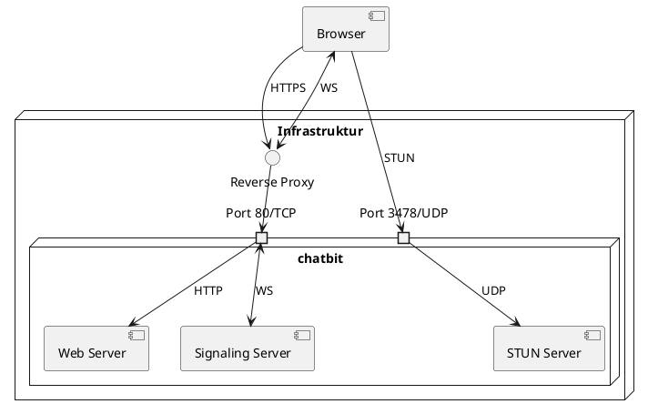
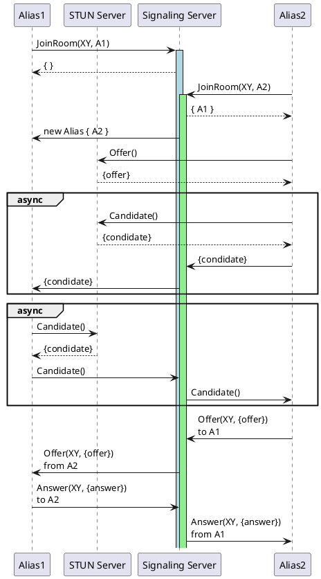

# ChatBit
AES Encrypted P2P Chat PWA

```plantuml
@startuml


' Horizontal lines: -->, <--, <-->
' Vertical lines: ->, <-, <->
node infra as "Infrastruktur" {
    node container as "chatbit" {
        port p1 as "Port 80/TCP"
        port p2 as "Port 3478/UDP"
          
        component stun as "STUN Server"
        
        component back as "Signaling Server"
        
        component web as "Web Server"
        
    }
    
   interface reverse_proxy as "Reverse Proxy"
   
   
   }
  
   component pwa as "Browser"
   
   p1 -> web : HTTP
   p1 <-> back : WS
   p2 -> stun : UDP
   
   
   pwa --> reverse_proxy : HTTPS
   pwa <--> reverse_proxy : WS
   
   pwa --> p2 : STUN
   
   
   reverse_proxy --> p1
  
@enduml
```

```plantuml
@startuml
    participant Alias1
    
    participant stun as "STUN Server"
    participant back as "Signaling Server"
    
    participant Alias2

    Alias1->back: JoinRoom(XY, A1)
    activate back #lightblue
    back-->Alias1: { } 
    
    Alias2->back: JoinRoom(XY, A2)
    activate back #lightgreen
    back-->Alias2: { A1 }
    back->Alias1: new Alias { A2 }
    
    Alias2->stun: Offer()
    stun-->Alias2: {offer}
    
    group async
        Alias2->stun: Candidate()
        stun-->Alias2: {condidate}
 
        Alias2->back: {condidate}
        back->Alias1: {condidate}
    end
    
    group async
        Alias1->stun: Candidate()
        stun-->Alias1: {condidate}
        
        Alias1->back: Candidate()
        back->Alias2: Candidate()
    end
    
    Alias2->back: Offer(XY, {offer})\nto A1
   
    back->Alias1: Offer(XY, {offer})\nfrom A2
    
    Alias1->back: Answer(XY, {answer})\nto A2
    Alias2<-back: Answer(XY, {answer})\nfrom A1
    
    
@enduml
```

Was mövhte ich
- User
  - Online /Offline

